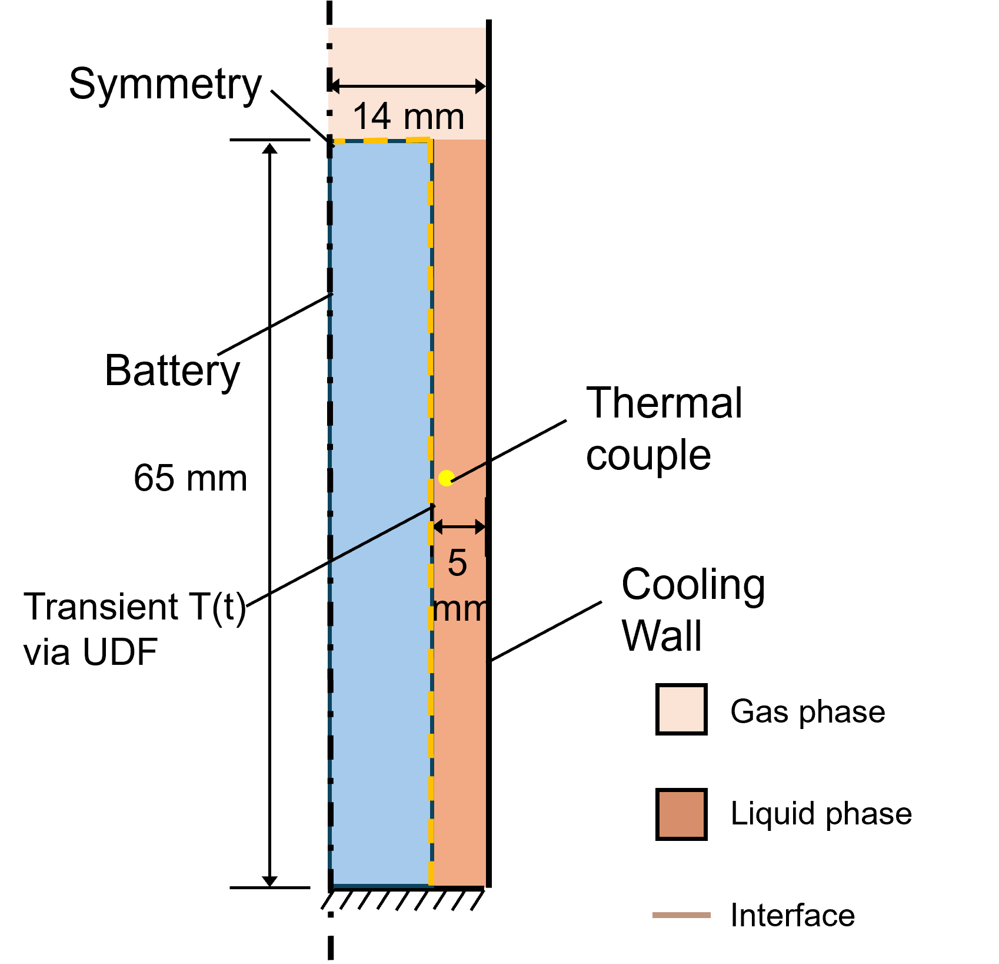
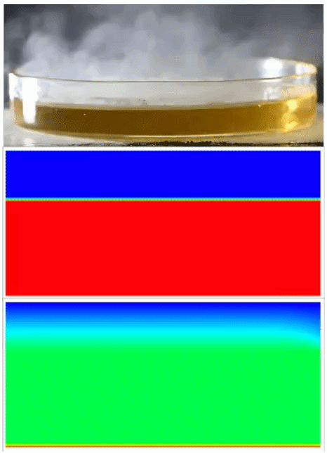
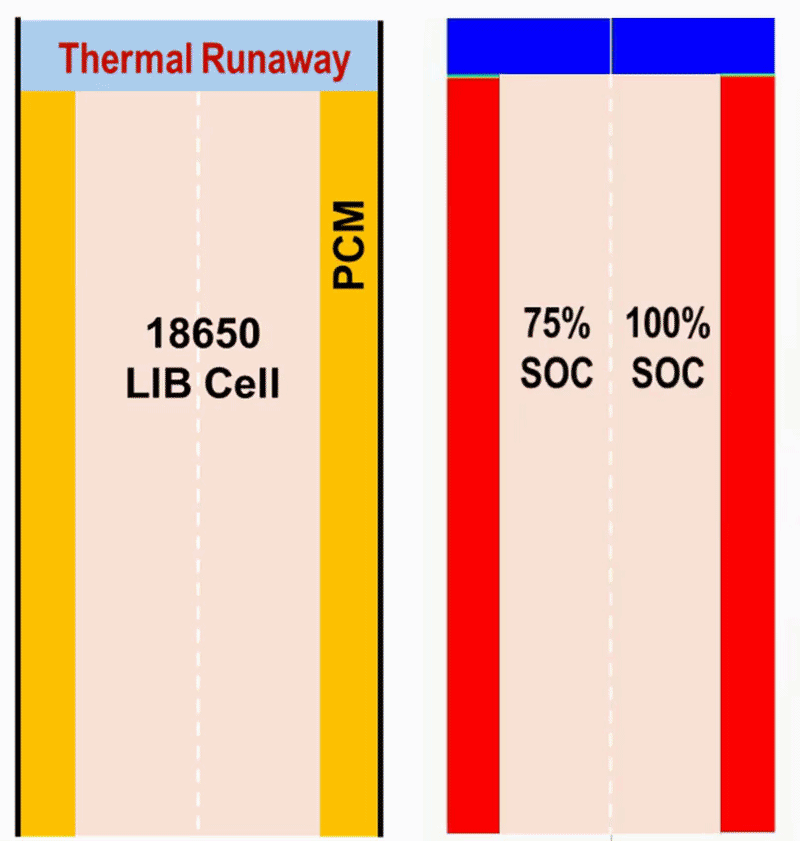
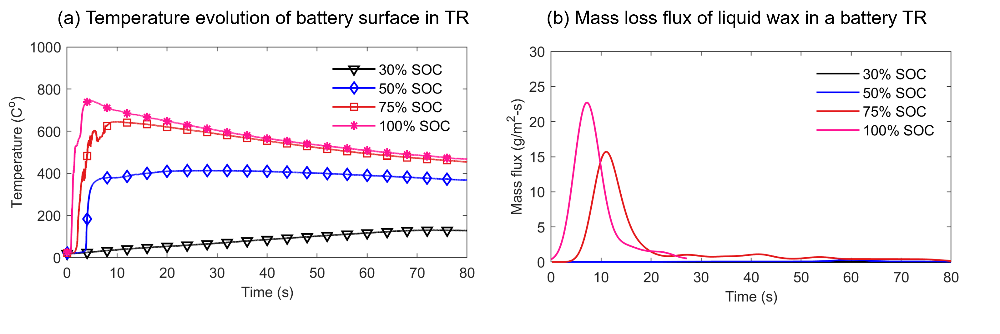
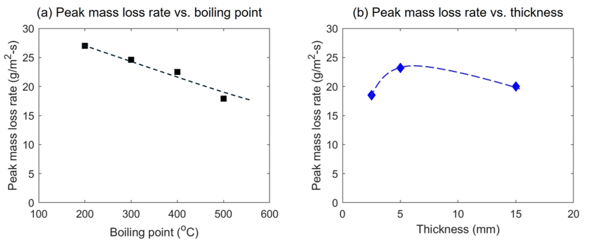

# VOF Simulation of PCM Boiling during Battery Thermal Runaway

**ANSYS Fluent | VOF Multiphase Flow | Phase Change | UDF | Battery Thermal Safety**

## Overview

This project investigates the boiling and evaporation behavior of phase change
material (PCM) exposed to the high-temperature surface of a lithium-ion battery
during thermal runaway.

A transient multiphase CFD model was developed in ANSYS Fluent using the
Volume of Fluid (VOF) method to capture liquid-vapor interface evolution and
bubble dynamics. Evaporation and condensation of paraffin wax were modeled
using the Lee phase-change model.

The model was first evaluated against controlled hot-plate experiments and then
applied to battery thermal-runaway conditions to evaluate how battery severity
and PCM design parameters influence boiling intensity, evaporation rate, and
thermal-safety risk.

---

## Numerical Model

| Parameter | Setting |
|---|---|
| Software | ANSYS Fluent |
| Multiphase model | Volume of Fluid (VOF) |
| VOF formulation | Explicit |
| Flow model | Laminar |
| Phase-change model | Lee model |
| Analysis | Transient |
| Pressure scheme | PRESTO! |
| Volume fraction | Geo-Reconstruct |
| Momentum | Second Order Upwind |
| Energy | Second Order Upwind |
| Time step | 0.0001 s |

Liquid PCM and vapor were modeled as separate phases with evaporation and
condensation mass-transfer terms to resolve transient boiling and interface
evolution.

---

## Battery Thermal-Runaway Application

The multiphase model was applied to a cylindrical lithium-ion battery surrounded
by PCM. A 2D half-domain was used with a symmetry boundary to reduce the
computational cost.

Experimentally measured, time-dependent battery surface temperatures during
thermal runaway were implemented as transient thermal boundary conditions using
a User Defined Function (UDF).

A 5 mm PCM layer was used as the representative case, with additional
thicknesses investigated in the parametric analysis.

*Figure 1. Battery-PCM computational domain and transient thermal boundary
condition used in the VOF simulation.*

---

## Model Evaluation

The VOF model was first evaluated against controlled hot-plate experiments.

The simulation reproduced key boiling features observed experimentally,
including bubble formation, growth, motion, and liquid-vapor interface
evolution.

*Figure 2. Hot-plate experimental validation of transient PCM boiling behavior.*

---

## Effect of Battery State of Charge

Battery SOC strongly affects the thermal-runaway boundary condition and the
resulting PCM boiling intensity.

The GIF below compares VOF-predicted boiling behavior under different SOC
conditions. Higher SOC leads to earlier vapor formation and more intensive PCM
boiling near the battery surface.

*Figure 3. VOF-predicted PCM boiling evolution under different battery SOC
conditions.*

Higher SOC also produces substantially greater PCM evaporation mass flux. The
predicted peak mass flux reaches approximately:

- **15 g/m²·s at 75% SOC**
- **23 g/m²·s at 100% SOC**

These values exceed the approximate **5–10 g/m²·s critical mass-flux range**
used as an indicator of increased ignition risk.

*Figure 4. Battery surface temperature histories and predicted PCM mass flux at
different SOC levels.*

---

## Parametric Analysis

The effects of PCM boiling point and layer thickness were investigated under
the same battery thermal-runaway condition.

Increasing the PCM boiling point reduced the predicted peak mass flux.

PCM thickness showed a nonlinear effect. The 5 mm case produced the highest
peak mass flux, while both thinner and thicker PCM layers resulted in lower
peak values.

*Figure 5. Effects of PCM boiling point and layer thickness on peak PCM mass flux.*

---

## Engineering Takeaways

- Experimental battery thermal-runaway temperature histories can be directly
  incorporated into CFD through UDF boundary conditions.
- VOF modelling captures transient PCM boiling and liquid-vapor interface
  evolution under severe battery heating conditions.
- Higher battery SOC produces significantly greater PCM evaporation and
  potential secondary ignition risk.
- PCM boiling point and layer thickness are important design parameters for
  battery thermal-safety systems.

---

## Reference

P. Sun, Y. Liu, L. Zhang, X. Huang, and Y. Nakamura,

“Multiphase modelling of bubbling in phase change material for battery thermal
safety management,” *Thermal Science and Engineering Progress*, Vol. 67,
104187, 2025.

DOI: 10.1016/j.tsep.2025.104187
